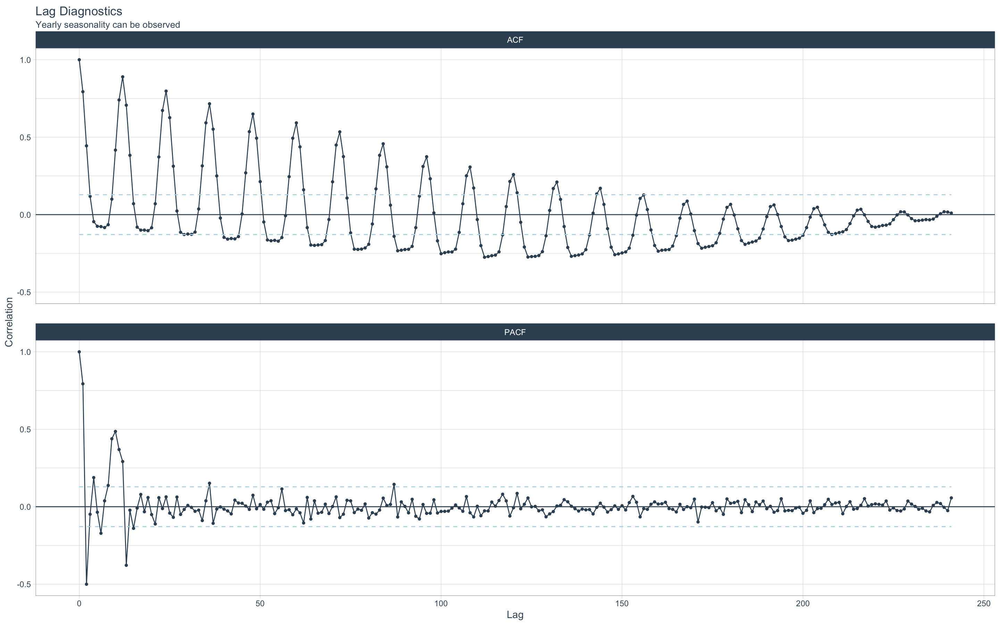

# US-Natural-Gas-Demand-Forecast
> Forecasting monthly natural gas demand in the United States until 2023-01-01 (i.e. next 24 months based on the dataset in use)

### Table of Contents

- [Description](#description)
- [Models Used](#models-used)
- [Natural Gas Demand Visualization](#natural-gas-demand-visualization)
- [Pre-Forecast Diagnostics](#pre-forecast-diagnostics)
- [Results](#results)
- [Post-Forecast Diagnostics](#post-forecast-diagnostics)
- [Further-Improvisation](#further-improvisation)

# Description

Our objective is to forecast the Natural Gas Demand of the United States up until January 1, 2023. The dataset utilized for this task is sourced from the USgas package, developed by Rami Krispin, who serves as the Data Science and Engineering Manager at Apple. To accomplish this, we have trained sequential models capable of generating forecasts for the next 24 months.

# Models Used

- Prophet
- ARIMA
- AUTO ARIMA
- ETS
- TBATS 
- STLM ETS
- STLM ARIMA 

# Natural Gas Demand Visualization

The following plot shows what the natural gas demand has been like in the United States since 2000 to 2020. 

  

Key observations from the presented visualization are as follows:

- There are no outliers that would significantly impact our forecast.
- The data appears to be mostly stationary.

# Pre-Forecast Diagnostics

- The ACF plot provided below enables us to identify the autocorrelated lags. It is evident from the plot that lag 12, 24, and 36 are expected to be significant.
- 

- Following the pre-processing procedures, we conducted an examination of lag and rolling lag features to determine which ones captured the trend more effectively. Based on the plot depicted below, it is apparent that rolling lags 12 and 24 exhibited a better representation of the underlying trend.

# Results

- Following pre-forecast diagnostics, the next step involved splitting the data into a training set and a testing set. The training set was utilized to train the models, while the testing set was used to assess their performance. By fitting the models to the training set and evaluating their performance on the testing set, we aimed to determine how well they generalize to unseen data.

- After conducting evaluations on various models such as ARIMA, AUTO ARIMA, PROPHET, ETS, TBATS, STLM ETS, and STLM ARIMA, it was observed that AUTO ARIMA exhibited superior performance compared to the other models when assessed on the testing set. This conclusion is further supported by the plot presented below, which visually demonstrates the favorable performance of the AUTO ARIMA model.

- Additionally, it was observed that both the TBATS and ETS models did not accurately capture the dipping patterns in the data. These models did not exhibit a satisfactory ability to identify and replicate the downward trends present in the dataset.
  

- As resampling and tuning were skipped in the process, a decision was made to utilize all the models to generate forecasts. Before proceeding with the forecasting procedures, it was deemed necessary to refit all the calibrated models using the `data_prep_tbl`, which excluded the dates to be forecasted. This step was taken to ensure that the models are updated with the most recent timestamps, as they play a crucial role in accurate time series forecasting.

- After refitting the models using the provided data, the next step involved utilizing the separate dataset specifically designated for forecasting purposes. This dataset was used to forecast the natural gas demand in the United States for the next 24 months. It is worth noting that one of the ARIMA models was updated after being refitted to the combined training, testing, and non-forecast data, ensuring it incorporates the most recent information for improved forecasting accuracy.

- After careful evaluation of the forecast results, it was determined that the `ARIMA(1,1,1)(2,1,1)[12]` model stood out as the most suitable choice. This particular model demonstrated excellent performance on the test set, effectively capturing spikes in demand, adhering to the overall trend, and maintaining stationarity. Additionally, it accounted for the significant drop in demand observed after 2020, further enhancing its capability to provide accurate forecasts. Considering these factors, the `ARIMA(1,1,1)(2,1,1)[12]` model was selected as the preferred model for generating forecasts.

- The plot below shows all models forecast. 

# Post-Forecast Diagnostics

- In order to assess the ability of the models to capture patterns in the data, we plotted the in-sample and out-of-sample residuals for all the models. This analysis allowed us to examine the discrepancies between the actual values and the predictions made by the models. By observing the residuals, we could identify any remaining patterns or systematic deviations that were not accounted for by the models.

- From the plot, doing an eye test, we can see the residuals being centered around 0. 

`ARIMA(1,1,1)(2,1,1)[12]` residuals for in-sample and out-of-sample data is plotted below. 

- To further enhance the performance of our chosen model, namely `ARIMA(1,1,1)(2,1,1)[12]`, it is prudent to investigate whether there is any remaining autocorrelation in the residuals. This examination will help determine if there is additional information that can be utilized to further refine the model's predictions. By assessing the autocorrelation in the residuals, we aim to identify any patterns or dependencies that could be leveraged to enhance the overall performance of the model.

- The provided plot demonstrates a lack of significant autocorrelation among the residuals. Notably, the plot utilizes out-of-sample data for autocorrelation analysis. This observation suggests that our algorithms and features have successfully extracted a substantial amount of valuable information.

# Further-Improvisation

- For improved detection of seasonal patterns, we can leverage machine learning models such as XGBoost, which exhibit enhanced capability in capturing such trends. Alternatively, a combination of PROPHET and XGBoost can be employed, as PROPHET excels at identifying overall trends, while XGBoost is proficient in detecting intricate patterns. By leveraging the strengths of these models, we can enhance the accuracy and effectiveness of our analyses.

- The only downside with using AUTO ARIMA or ARIMA models are that they only pick up single seasonality, so if we wanted to model complex seasonalities/ multiple seasonalities ARIMA might not be the best model for us. 
